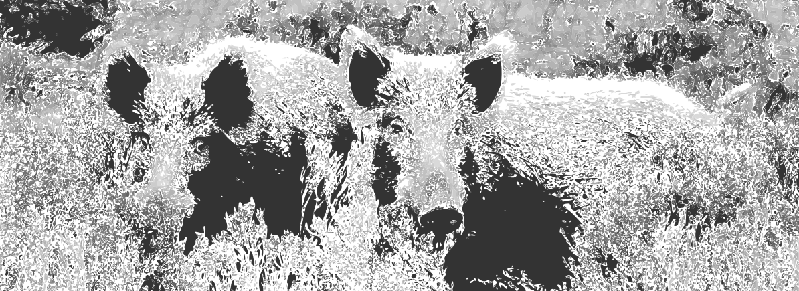

Introduction to GRM3
===================

## Content ##
This repository is meant to share solutions of exercises provided in the course Geographical research methods 3. 
Be aware that this folder contains contributions of students which might not have been verified.   
For questions and remarks: benjamin.campforts@kuleuven.be

## How to use this repository ##
* Fork repository to your own GitHub account
* Commit changes to your own fork 
* Make a pull request to the master branch once you are happy with the result
* Make sure to respect the structure of the main repository. Each exercise goes in one folder where both scripts and functions are collected. 
* Different solutions to the same problem are allowed. But, if your alternative solution is an adjustment/improvement/correction of an existing solution, make sure to adjust the exisitng commit rather than doing a new pull request. 
* Make sure to **NOT REMOVE** any of the content. 

## Links ##
Links which might be helpfull for this course/repository. Feel free to add. 

[How markdown works!](https://guides.github.com/features/mastering-markdown/#examples)

## Content ##

Exercise	  | Description	|	Status
------------- | ------------	| -------------
Exercise 1.1 |	Analytical solution for wild boar population growth	|  [x] TODO   [ ] completed 
Exercise 1.2 |	Numerical solution for wild boar population growth	|  [x] TODO   [ ] completed 
Slope of a DEM |	Calculate the slope of the DEM.mat file using  (i) a moving window and  (ii) **linear indices**  	|  [x] TODO   [ ] completed 
